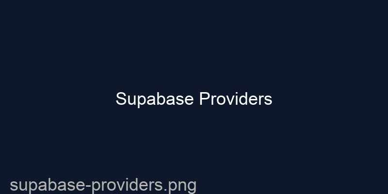
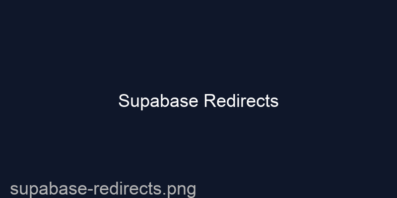
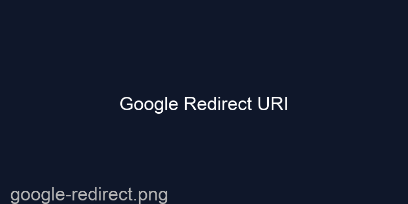

# Supabase OAuth Setup (Google + Facebook)

เอกสารนี้เป็นขั้นตอนเต็ม ๆ เพื่อให้โปรเจกต์ `dj-music-marketplace` ใช้งานการลงชื่อเข้าใช้ด้วย Google และ Facebook ผ่าน Supabase ได้สำเร็จ

## 1. เตรียมเครื่องมือก่อน

สิ่งที่ต้องมี
- โปรเจกต์ Supabase
- บัญชี Google Cloud Console
- บัญชี Facebook for Developers
- `.env` หรือ `.env.local` ใน root โปรเจกต์
- `VITE_SUPABASE_URL` และ `VITE_SUPABASE_ANON_KEY` จาก Supabase

ไฟล์ตัวอย่างที่มีแล้ว: `.env.example`

## 2. ตั้งค่า Supabase

1. เข้าสู่ระบบ Supabase
   - ไปที่ https://app.supabase.com
   - เลือกโปรเจกต์ของคุณ

2. คัดลอกค่า Supabase
   - ไปที่ `Settings` > `API`
   - คัดลอก `Project URL` เป็น `VITE_SUPABASE_URL`
   - คัดลอก `anon key` ในส่วน `Project API keys` เป็น `VITE_SUPABASE_ANON_KEY`

3. เปิดใช้งาน Provider
   - ไปที่ `Authentication` > `Providers`
   - เปิด `Google`
   - เปิด `Facebook`

   
   *ตัวอย่างหน้าจอการเปิดใช้งาน Provider ใน Supabase*

4. ตั้งค่า Redirect URLs ใน Supabase
   - ใส่ URL ดังนี้
     - `http://localhost:5173/auth?oauth=1&provider=google`
     - `http://localhost:5173/auth?oauth=1&provider=facebook`
   - หากโปรดักชัน ให้เปลี่ยน `localhost:5173` เป็นโดเมนจริงของเว็บคุณ

   
   *ตัวอย่างหน้าจอการใส่ Redirect URLs ใน Supabase*

5. ตั้ง client ID / secret
   - Supabase จะขอข้อมูลจาก Google และ Facebook
   - ใส่ค่าที่ได้จากขั้นตอนต่อไป

## 3. ตั้งค่า Google OAuth

1. เปิด Google Cloud Console
   - ไปที่ https://console.cloud.google.com
   - เลือกโปรเจกต์ใหม่หรือโปรเจกต์เดิม

2. เปิดใช้งาน OAuth consent screen
   - ที่เมนูด้านซ้าย ไปที่ `APIs & Services` > `OAuth consent screen`
   - เลือก `External` ถ้าผู้ใช้เป็นคนทั่วไป
   - กรอกข้อมูลพื้นฐาน เช่น App name, User support email, Developer contact email
   - บันทึก

3. สร้าง Credentials
   - ไปที่ `APIs & Services` > `Credentials`
   - กด `Create Credentials` > `OAuth client ID`
   - เลือก `Web application`
   - ใน `Authorized redirect URIs` ใส่:
     - `http://localhost:5173/auth?oauth=1&provider=google`
   - บันทึก

   
   *ตัวอย่างหน้าจอการตั้งค่า Authorized redirect URI ใน Google Cloud Console*

4. คัดลอก Google client ID / client secret
   - นำค่า `Client ID` และ `Client secret`
   - วางลงใน Supabase `Authentication` > `Providers` > `Google`
   - บันทึกการตั้งค่า

## 4. ตั้งค่า Facebook OAuth

1. เข้าสู่ Facebook for Developers
   - ไปที่ https://developers.facebook.com
   - สร้างแอปใหม่ (`Create App`)
   - เลือกประเภทแอปเป็น `Consumer` แล้วกด `Next`

2. ตั้งค่า Facebook Login
   - ใน Dashboard ของแอป เลือก `Add Product` > `Facebook Login`
   - เลือก `Web`
   - ใส่ URL เว็บของคุณ เช่น `http://localhost:5173`

3. ตั้งค่า Valid OAuth Redirect URIs
   - ไปที่ `Facebook Login` > `Settings`
   - ใน `Valid OAuth Redirect URIs` ใส่:
     - `http://localhost:5173/auth?oauth=1&provider=facebook`
   - บันทึกการตั้งค่า

4. คัดลอก App ID / App Secret
   - กลับไปที่หน้าหลักของแอป
   - คัดลอก `App ID` และ `App Secret`
   - วางลงใน Supabase `Authentication` > `Providers` > `Facebook`
   - บันทึกการตั้งค่า

## 5. ตั้งค่าตัวแปรแวดล้อมในโปรเจกต์

สร้างไฟล์ `.env` ที่ root โปรเจกต์ แล้วใส่ค่าดังนี้:

```env
VITE_SUPABASE_URL=https://your-project.supabase.co
VITE_SUPABASE_ANON_KEY=your-anon-key
JWT_SECRET=replace_with_strong_secret
ADMIN_EMAILS=admin@beatvault.dj,bbeatonportdj@gmail.com
ALLOWED_ORIGINS=http://localhost:5173,http://127.0.0.1:5173
```

- `JWT_SECRET` ใช้สำหรับเซ็น JWT ของฝั่ง backend
- `ALLOWED_ORIGINS` ต้องครอบคลุมทั้ง `localhost` และ host ที่ใช้จริง

## 6. โค้ดที่รองรับ OAuth ในโปรเจกต์นี้

ใน `src/context/AuthContext.tsx` โค้ดได้กำหนดให้:
- `signInWithGoogle()` redirect ไปยัง `/auth?oauth=1&provider=google`
- `signInWithFacebook()` redirect ไปยัง `/auth?oauth=1&provider=facebook`

ใน `src/pages/Auth.tsx` จะตรวจสอบ query string และ:
- เรียกฟังก์ชัน Supabase เพื่ออ่าน session
- ส่ง `provider`, `email`, `display_name`, `oauth_id` ไปยัง backend `/api/auth/oauth`
- backend จะสร้างหรือเชื่อมบัญชี และคืน `token` เป็น JWT

## 7. คำสั่งรันโปรเจกต์

```bash
npm install
npm run dev
```

แล้วเปิดเว็บที่:

```text
http://localhost:5173/auth
```

## 8. ทดสอบการลงชื่อเข้าใช้

1. เปิดหน้า `/auth`
2. คลิกปุ่ม `Google`
3. ให้สิทธิ์ Google และกลับมาเว็บ
4. ถ้ายังไม่เคยสมัคร ระบบจะสร้างบัญชีใหม่

หรือ

1. เปิดหน้า `/auth`
2. คลิกปุ่ม `Facebook`
3. ยืนยันสิทธิ์ Facebook
4. ถ้ายังไม่เคยสมัคร ระบบจะสร้างบัญชีใหม่

## 9. ตรวจสอบเมื่อเกิดปัญหา

- ถ้าไม่ได้ redirect กลับ: ตรวจสอบ `redirect URI` ใน Google/Facebook และ Supabase ให้ตรงกัน
- ถ้าเรียก `/api/auth/oauth` แล้ว error:
  - ตรวจสอบว่า `email`, `oauth_id`, `provider` ถูกส่งถูกต้อง
  - ตรวจสอบว่า backend สามารถเชื่อมกับฐานข้อมูลได้
- ถ้า login แล้วไม่เก็บ token:
  - ตรวจสอบว่ามี `localStorage` บันทึก `jwt_token`
  - เปิด DevTools > Network เพื่อตรวจ HTTP response

## 10. รูปแบบ URL สำหรับ production

ถ้าลงเว็บจริง ให้แทน `localhost:5173` ด้วยโดเมนจริง เช่น:

```text
https://yourdomain.com/auth?oauth=1&provider=google
https://yourdomain.com/auth?oauth=1&provider=facebook
```

แล้วอัพเดตทั้งใน Supabase, Google Cloud และ Facebook Developer ด้วย
